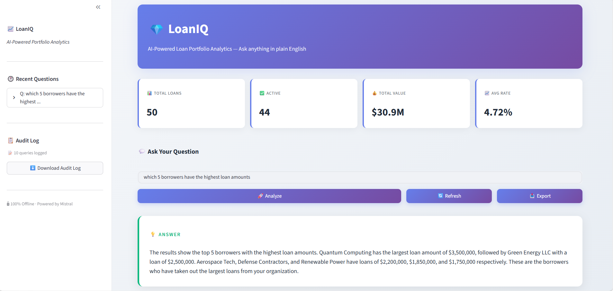

# 💎 LoanIQ — AI-Powered Loan Portfolio Analytics

> **Ask your loan portfolio anything. Get answers in plain English. 100% offline.**

Built for finance executives who need instant insights without waiting for IT or analysts. No SQL knowledge required. No cloud dependencies. No data leaves your machine.

---

## ⚡ The Problem

Finance teams sit on piles of Excel spreadsheets but can't get fast answers:
- 📈 Need defaulted loan trends? → Build a pivot table
- 💼 Quarterly review tomorrow? → Hope someone has time

**LoanIQ solves this in seconds.**

---

## 🚀 What It Does

Type a question in plain English. Get an instant answer with the data behind it.

| You ask... | LoanIQ does... |
|---|---|
| "How many loans are active?" | Generates SQL, queries DuckDB, returns "44 loans currently active, totaling $28.4M" |
| "What's our total exposure to Bank A?" | Aggregates across files, returns breakdown by status |
| "Show me defaulted loans over $100K" | Filters, ranks, displays full detail table |

**Behind the scenes:**
1. 🧠 Local LLM (Mistral) translates your question to SQL
2. ⚡ DuckDB executes against your loan data
3. 💬 LLM narrates the result in plain English
4. 📋 Every query is logged for audit compliance

---

## ✨ Key Features

### 🔒 100% Offline & Private
- Runs entirely on your machine
- No API calls, no cloud, no data ever leaves your environment
- Perfect for regulated industries (banking, insurance, private equity)

### 🎯 Built for Non-Technical Users
- No SQL knowledge required
- Friendly error messages (no Python tracebacks)
- Suggested questions to get started instantly
- One-click data refresh and Excel export

### 📊 Modern Fintech Dashboard
- Real-time KPIs (total loans, active count, total value, average rate)
- Conversational loading states
- Last 3 questions remembered for follow-ups
- Clean, executive-ready interface

### 🛡️ Enterprise-Grade Audit Trail
- Every question and generated SQL logged to CSV
- Compliance-ready for regulated environments
- Full transparency: "show how this was answered" panel